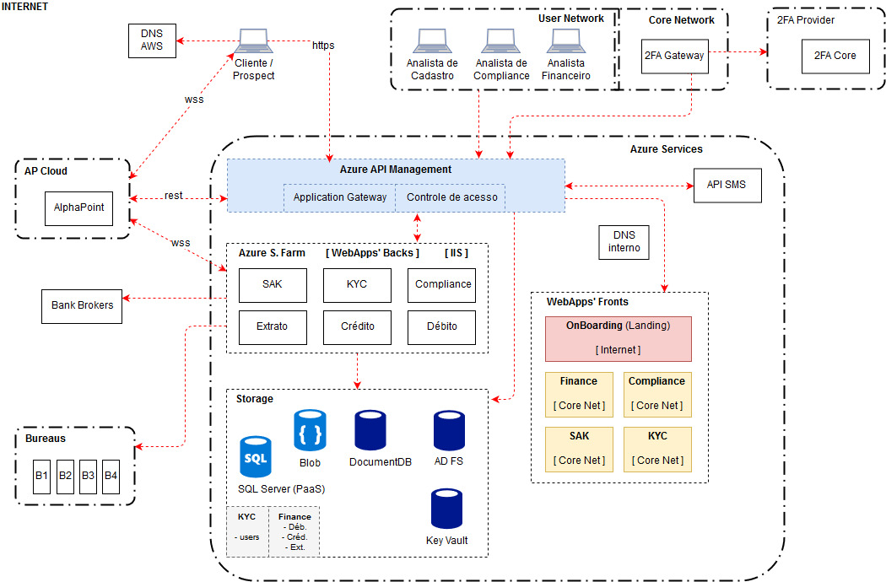

# Modelagem de Ameaças

Este trabalho faz parte da disciplina **Modelagem de Ameaças**, da **Especialização em Cibersegurança** da **Cesar School**, ministrada pelo professor **Rafael Lachi**. O objetivo é analisar o cenário de uma exchange fictícia, chamada **CypherTrade**, aplicando os passos descritos na atividade para identificar ameaças, avaliar riscos e propor controles de segurança.

Este trabalho foi desenvolvido pelo grupo formado por **Francisco Moura**, **Pedro Coelho**, **Rivaldo Junior** e **Valdenir Junior**.

### **Objetivo da Atividade**
- Identificar os perfis de atacantes mais prováveis e justificar suas escolhas.
- Descrever os objetivos primários e secundários desses atacantes.
- Modelar árvores de ameaças com base na arquitetura da solução e nos processos de negócios.
- Classificar riscos e propor controles de segurança para mitigar os principais problemas.

## Contexto Fictício

A CypherTrade é uma exchange de criptomoedas de médio porte, com foco no mercado latino-americano. Ela utiliza uma solução whitelabel fornecida pela plataforma AlphaPoint, que permite gerenciar operações como compra, venda e armazenamento de criptomoedas. No entanto, apesar de adotar soluções terceirizadas para partes do seu sistema, a responsabilidade por processos como aquisição de clientes, validação de identidade, monitoramento de transações e suporte ao cliente é integralmente da CypherTrade.

Com o aumento do interesse em criptomoedas na mídia, especialmente após histórias de enriquecimento rápido, a CypherTrade cresceu exponencialmente nos últimos dois anos. Este crescimento atraiu a atenção não apenas de investidores legítimos, mas também de atores maliciosos que buscam explorar brechas no sistema para seus próprios fins.

## **Arquitetura da Solução**

A **CypherTrade** opera em uma arquitetura híbrida baseada na nuvem, com uma forte dependência de soluções externas para escalabilidade e eficiência operacional. Os principais componentes da arquitetura são:

### **1. Serviços de Frontend**
- **Onboarding:** Plataforma de entrada para novos clientes e prospects, acessível pela internet.
- **Finance:** Gerencia processos financeiros (Core Net), como crédito, débito e extratos.
- **Compliance:** Parte do Core Net, oferece suporte às operações de conformidade regulatória, garantindo que transações e perfis de clientes estejam em conformidade com as leis.
- **SAK:** Parte do Core Net, Sistema de Autorização e Controle responsável por validar e autorizar transações, garantindo que apenas operações legítimas sejam processadas.
- **KYC:** Parte do Core Net, implementa funções específicas de autenticação de identidade, avaliação de risco financeiro e verificação de clientes.

### **2. Serviços Backend**
Os serviços backend utilizam a **Azure Service Farm**:

- **SAK:** Responsável por validar e autorizar transações, garantindo que apenas operações legítimas sejam processadas.
- **KYC:** Gerencia a verificação de identidade e integridade dos dados dos clientes, além de avaliar riscos associados ao perfil.
- **Compliance:** Processa e monitora transações para atender às normas regulatórias, como AML (Anti-Money Laundering) e CFT (Counter-Terrorism Financing).
- **Crédito/Débito:** Coordena as operações financeiras, incluindo transferências internas e externas.
- **Extrato:** Oferece suporte ao registro e consulta de transações realizadas pelos usuários.

### **3. Armazenamento de Dados**

- **SQL Server (PaaS):** Base de dados relacional para armazenar informações transacionais, perfis de clientes e registros financeiros.
- **Blob Storage:** Utilizado para o armazenamento de documentos, como os submetidos no processo de KYC, além de outros dados sensíveis.
- **DocumentDB:** Banco de dados não relacional otimizado para transações de alta escalabilidade e desempenho, como registros de movimentações financeiras.
- **AD FS (Active Directory Federation Services):** Gerencia identidades e acessos, fornecendo suporte a autenticações seguras.
- **Key Vault:** Armazena e protege credenciais, chaves de criptografia e segredos usados pela plataforma.

### **4. Gerenciamento de APIs**
O acesso a APIs é centralizado através do **Azure API Management**:

- **Application Gateway:** Responsável por gerenciar o tráfego de rede, distribuindo requisições de forma eficiente e protegendo os serviços contra ataques, como DDoS.
- **Controle de Acesso:** Implementa autenticação e autorização para o uso de APIs internas e externas, assegurando que apenas usuários e sistemas autorizados possam acessar os recursos da plataforma.

### **5. Redes e Serviços Externos**
- **AlphaPoint:** Serviço whitelabel que oferece suporte às operações de compra, venda e armazenamento de criptomoedas, sendo o núcleo da funcionalidade de mercado da exchange.
- **2FA Provider:** Sistema de autenticação em dois fatores que reforça a segurança durante o login e em transações sensíveis, protegendo contas de usuários.
- **APIs SMS:** Utilizadas para o envio de notificações aos usuários, incluindo alertas transacionais e verificações de segurança para autenticação.
- **Bureaus Externos:** Integrações com provedores de dados financeiros e de crédito, fornecendo informações essenciais para os processos de compliance e KYC.

### **6. Segurança e Monitoramento**

- **DNS Interno e AWS DNS:** Garantem a conectividade segura e confiável entre os sistemas internos e externos da plataforma, minimizando riscos de interrupções.
- **Analistas:** A equipe interna é organizada em funções específicas (Cadastro, Compliance e Financeiro) para segregar responsabilidades, limitar o acesso a informações críticas e reduzir o risco de atividades maliciosas.
- **Controle de Acessos:** Implementado para assegurar que apenas usuários e sistemas autorizados tenham acesso aos dados e operações sensíveis da plataforma.

## **Pesquisa**

**1. Ronin Network**  
- **Data:** Março de 2022  
- **Descrição:** Um grupo de cibercriminosos, supostamente norte-coreano, realizou a maior invasão de transação de criptomoedas até então. Usando chaves privadas roubadas dos proprietários, os invasores sacaram moedas no valor de **US$ 625 milhões**, incluindo Ethereum e USDC stablecoin. Este ataque se tornou um exemplo notório de invasão por roubo de chaves.
- [Fonte](https://www.infomoney.com.br/mercados/ronin-do-axie-infinity-sofre-maior-hack-da-historia-das-criptomoedas-avaliado-em-us-625-milhoes/)

**2. Poly Network**
- **Data:** Agosto de 2021  
- **Descrição:** Explorando uma vulnerabilidade no software da Poly Network, um invasor roubou **US$ 611 milhões** em criptomoedas. Posteriormente, o invasor revelou que o ataque foi realizado apenas para testar as defesas do sistema e devolveu todos os fundos.
- [Fonte](https://www.moneytimes.com.br/poly-network-sofre-o-maior-hack-da-historia-do-setor-defi/)

**3. FTX**
- **Data:** Novembro de 2022 e Janeiro de 2023  
- **Descrição:**  
  - **Primeiro ataque:** Durante o processo de falência da FTX, cibercriminosos roubaram mais de **US$ 600 milhões** de suas carteiras.  
  - **Segundo ataque:** Em janeiro de 2023, outra invasão resultou no roubo de **US$ 15 milhões**. Este caso é notório devido ao prestígio da FTX como um dos maiores nomes da indústria.
- [Fonte](https://www.infomoney.com.br/mercados/ftx-sofre-suposto-hack-e-tem-contas-drenadas-em-us-600-milhoes/)

**4. Binance**
- **Data:** Outubro de 2022  
- **Descrição:** Os invasores exploraram a ponte entre cadeias da **BSC Token Hub** para criar moedas extras da Binance. Em seguida, desviaram todas as moedas disponíveis, totalizando um roubo de **US$ 570 milhões**. Este ataque destacou vulnerabilidades nas pontes entre blockchains.
- [Fonte](https://portaldobitcoin.uol.com.br/manha-cripto-bnb-recua-3-apos-rombo-de-us-100-milhoes-na-bnb-smart-chain-e-bitcoin-btc-em-compasso-de-espera/)

**5. Coincheck**
- **Data:** Janeiro de 2018  
- **Descrição:** Em Tóquio, os invasores exploraram uma vulnerabilidade na carteira virtual quente da Coincheck para roubar **US$ 534 milhões** em moedas NEM. A empresa reembolsou os clientes usando seu capital, estabelecendo um padrão para empresas invadidas.
- [Fonte](https://www.infomoney.com.br/mercados/exchange-japonesa-perde-r-17-bilhao-no-maior-roubo-de-criptomoedas-da-historia/)

**6. Mt. Gox**
- **Datas:** 2011 e 2014  
- **Descrição:**  
  - **Primeiro ataque:** Em 2011, quando processava cerca de 70% das transações de criptomoedas, a Mt. Gox perdeu moedas no valor de **US$ 400 mil**.  
  - **Segundo ataque:** Em 2014, lidando com cerca de 7% das bitcoins disponíveis, a plataforma sofreu outro ataque, resultando em uma perda de **US$ 437 milhões**. Esses ataques levaram à falência da empresa.
- [Fonte](https://www.infomoney.com.br/colunistas/moeda-na-era-digital/o-colapso-da-mtgox-uma-corrida-bancaria-digital-parte-1-2/)

**7. Bitmart**
- **Data:** Dezembro de 2021  
- **Descrição:** Usando chaves de administrador roubadas, os invasores acessaram as moedas da exchange Bitmart e desviaram mais de **US$ 196 milhões**, movimentando os fundos por Ethereum e Binance.
- [Fonte](https://www.moneytimes.com.br/apos-hack-de-us-196-milhoes-bitmart-diz-que-compensara-vitimas-com-fundos-proprios/)

**8. Nomad Bridge**
- **Data:** 2022  
- **Descrição:** Explorando uma vulnerabilidade na funcionalidade de movimentação entre blockchains da Nomad Bridge, os invasores roubaram **US$ 190 milhões**. Apenas **US$ 36 milhões** dos fundos foram recuperados.
- [Fonte](https://www.cisoadvisor.com.br/bridge-de-blockchain-perde-us-190-milhoes-em-poucas-horas/)

## 1 - **Perfis de Atacantes**

| **Perfil**               | **Aplica** | **Interesse**         | **Motivação**                                                                                      | **Métodos**                                                                                  |
|---------------------------|------------|-----------------------|----------------------------------------------------------------------------------------------------|---------------------------------------------------------------------------------------------|
| ✅ **Fraudador/Carder**    | Sim        | Médio a Alto          | Vender dados de cartões roubados e converter fundos para criptomoedas difíceis de rastrear.        | Acessam contas para converter e transferir valores anonimamente.                           |
| ✅ **Ransomware Hacker**   | Sim        | Muito Alto            | Exigir resgates em criptomoedas e usá-las para liquidação ou lavagem de fundos.                   | Comprometem sistemas, instalam ransomware e transferem fundos para exchanges.              |
| ✅ **Hacktivista**         | Sim        | Médio                | Demonstrar fragilidade das exchanges ou protestar contra centralização e regulamentação.           | Atacam sistemas e divulgam falhas publicamente.                                             |
| ✅ **Fraudador Bancário**  | Sim        | Alto                 | Transformar fundos ilícitos em criptomoedas para dificultar rastreamento.                         | Lavagem de dinheiro com transações menores e transferências em exchanges.                  |
| ✅ **Crime Organizado**    | Sim        | Muito Alto            | Financiar atividades ilícitas e lucrar com ativos digitais roubados.                              | Transferência de fundos para carteiras anônimas e lavagem de dinheiro.                     |
| ✅ **Estelionatário**      | Sim        | Médio                | Explorar movimentações financeiras da exchange para obter valores ilícitos.                       | Utilizam falhas no processo para desviar ou manipular valores.                              |
| ❌ **Spammer**             | Não        | Baixo                | Interagir indiretamente com vítimas por phishing.                                                 | Tentativas de phishing sem interação direta com exchanges.                                  |
| ❌ **Troll**               | Não        | Baixo                | Campanhas de desinformação em fóruns e redes sociais.                                             | Sem impacto direto na exchange.                                                             |
| ❌ **Espião Governamental**| Não        | Médio                | Interferir na economia de países ou rastrear transações financeiras.                              | Alvo principal são interesses geopolíticos, não exchanges.                                  |
| ❌ **Espião Industrial**   | Não        | Médio                | Obter informações de mercado e práticas operacionais para vantagem competitiva.                  | Ataques visando dados de custódia ou segurança, mas baixo interesse em exchanges padrão.    |
| ❌ **Bot-Herder**          | Não        | Baixo                | Controlar botnets para uso malicioso.                                                             | Infraestrutura em nuvem dificulta ataques baseados em domínio físico de servidores.         |
| ❌ **Fraudador (Genérico)**| Não        | Baixo                | Explorar falhas genéricas no sistema para lucro.                                                  | Controles já minimizam impacto deste perfil.                                                |

## 2 - Objetivos dos Atacantes

| **Perfil**               | **Objetivo Primário**                                                   | **Objetivo Secundário**                                                                                   |
|---------------------------|------------------------------------------------------------------------|----------------------------------------------------------------------------------------------------------|
| **Fraudador/Carder**      | Converter fundos ilícitos (cartões roubados) para criptomoedas.        | Movimentar e transferir valores anonimamente, dificultando o rastreamento.                              |
| **Ransomware Hacker**     | Exigir resgates em criptomoedas após comprometer sistemas.             | Lavar fundos obtidos de resgates por meio da anonimização em exchanges.                                 |
| **Hacktivista**           | Expor vulnerabilidades de segurança nas exchanges.                    | Protestar contra centralização e regulamentação do mercado de criptomoedas.                             |
| **Fraudador Bancário**    | Transformar fundos ilícitos de fraudes bancárias em criptomoedas.      | Realizar lavagem de dinheiro em larga escala com transações menores e complexas.                        |
| **Crime Organizado**      | Financiar atividades ilícitas e lavar dinheiro.                       | Roubar ativos digitais para maximizar lucros e dificultar rastreamento por autoridades.                 |
| **Estelionatário**        | Manipular processos financeiros para desviar valores.                 | Explorar falhas em movimentações financeiras ou políticas de segurança da exchange.                     |

## 3 - Árvore de Ameaças

