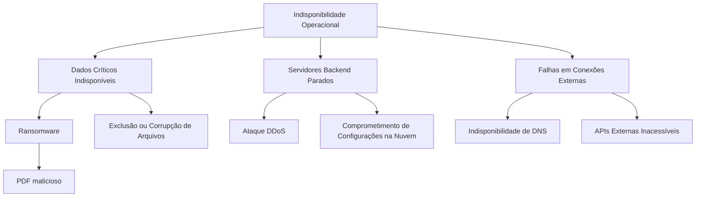
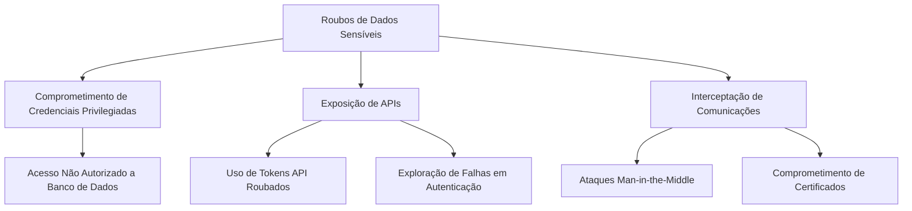
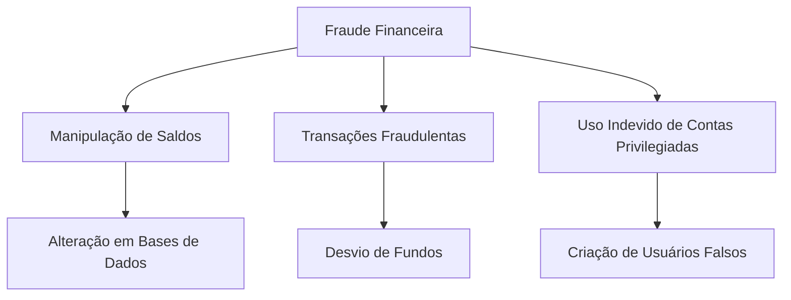
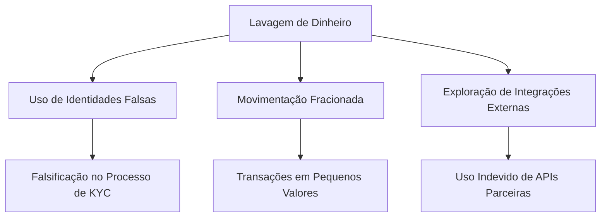
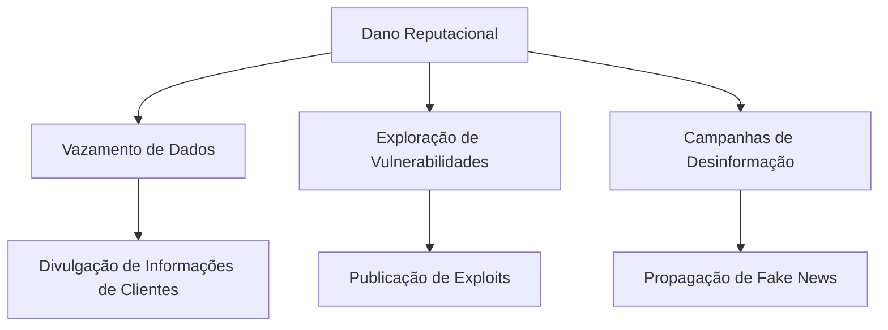
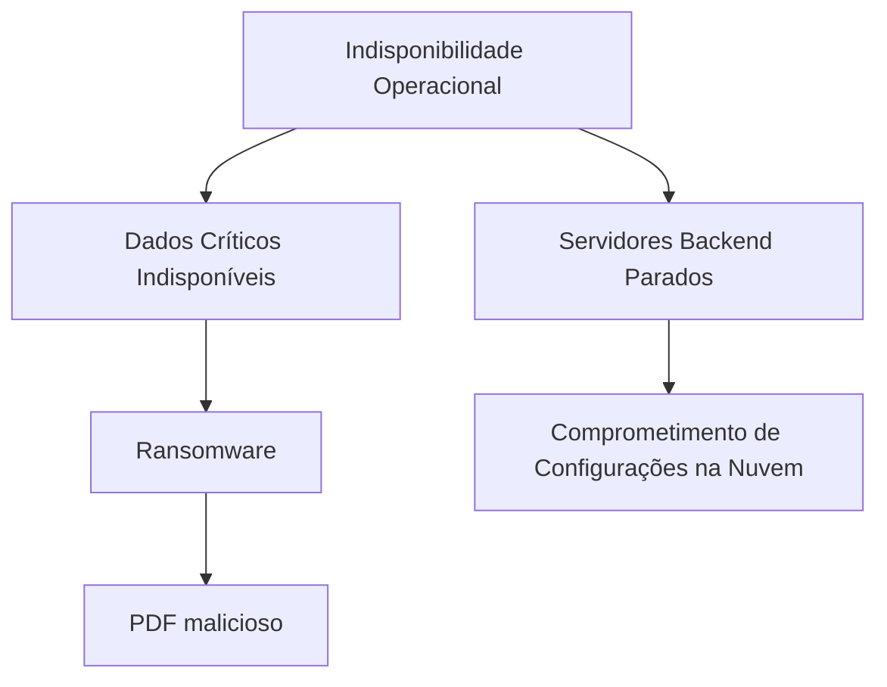
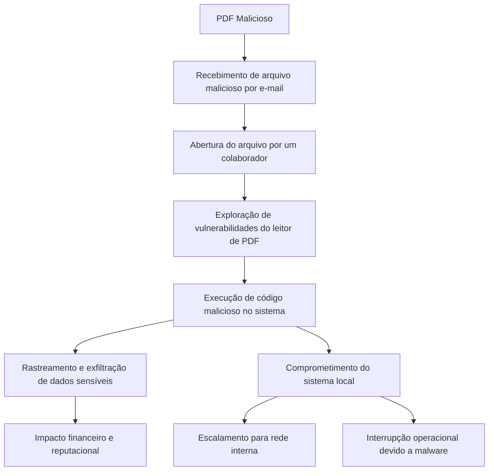
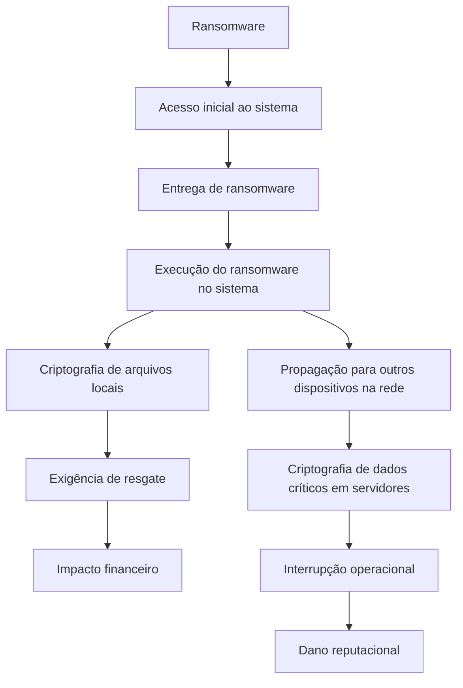
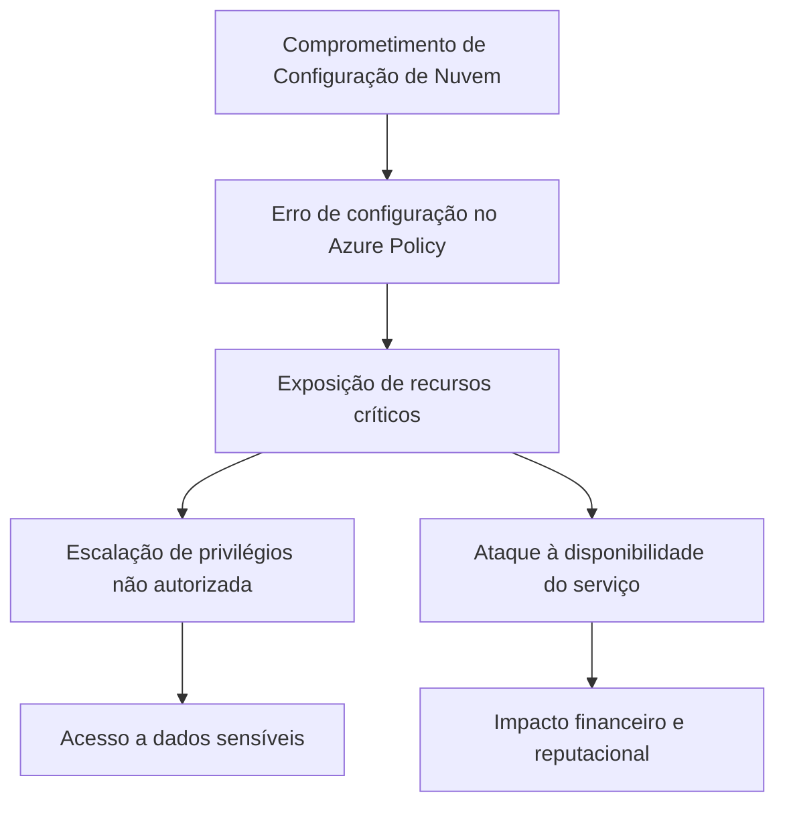

# Modelagem de Ameaças

Este trabalho faz parte da disciplina **Modelagem de Ameaças**, da **Especialização em Cibersegurança** da **Cesar School**, ministrada pelo professor **Rafael Lachi**. O objetivo é analisar o cenário de uma exchange fictícia, chamada **CypherTrade**, aplicando os passos descritos na atividade para identificar ameaças, avaliar riscos e propor controles de segurança.

Este trabalho foi desenvolvido pelo grupo formado por **Francisco Moura Fé**, **Pedro Coelho**, **Rivaldo Junior** e **Valdenir Junior**.

### **Objetivo da Atividade**
- Identificar os perfis de atacantes mais prováveis e justificar suas escolhas.
- Descrever os objetivos primários e secundários desses atacantes.
- Modelar árvores de ameaças com base na arquitetura da solução e nos processos de negócios.
- Classificar riscos e propor controles de segurança para mitigar os principais problemas.

## Contexto Fictício

A CypherTrade é uma exchange de criptomoedas de médio porte, com foco no mercado latino-americano. Ela utiliza uma solução whitelabel fornecida pela plataforma AlphaPoint, que permite gerenciar operações como compra, venda e armazenamento de criptomoedas. No entanto, apesar de adotar soluções terceirizadas para partes do seu sistema, a responsabilidade por processos como aquisição de clientes, validação de identidade, monitoramento de transações e suporte ao cliente é integralmente da CypherTrade.

Com o aumento do interesse em criptomoedas na mídia, especialmente após histórias de enriquecimento rápido, a CypherTrade cresceu exponencialmente nos últimos dois anos. Este crescimento atraiu a atenção não apenas de investidores legítimos, mas também de atores maliciosos que buscam explorar brechas no sistema para seus próprios fins.

## **Arquitetura da Solução**

A **CypherTrade** opera em uma arquitetura híbrida baseada na nuvem, com uma forte dependência de soluções externas para escalabilidade e eficiência operacional. Os principais componentes da arquitetura são:

### **1. Serviços de Frontend**
- **Onboarding:** Plataforma de entrada para novos clientes e prospects, acessível pela internet.
- **Finance:** Gerencia processos financeiros (Core Net), como crédito, débito e extratos.
- **Compliance:** Parte do Core Net, oferece suporte às operações de conformidade regulatória, garantindo que transações e perfis de clientes estejam em conformidade com as leis.
- **SAK:** Parte do Core Net, Sistema de Autorização e Controle responsável por validar e autorizar transações, garantindo que apenas operações legítimas sejam processadas.
- **KYC:** Parte do Core Net, implementa funções específicas de autenticação de identidade, avaliação de risco financeiro e verificação de clientes.

### **2. Serviços Backend**
Os serviços backend utilizam a **Azure Service Farm**:

- **SAK:** Responsável por validar e autorizar transações, garantindo que apenas operações legítimas sejam processadas.
- **KYC:** Gerencia a verificação de identidade e integridade dos dados dos clientes, além de avaliar riscos associados ao perfil.
- **Compliance:** Processa e monitora transações para atender às normas regulatórias, como AML (Anti-Money Laundering) e CFT (Counter-Terrorism Financing).
- **Crédito/Débito:** Coordena as operações financeiras, incluindo transferências internas e externas.
- **Extrato:** Oferece suporte ao registro e consulta de transações realizadas pelos usuários.

### **3. Armazenamento de Dados**

- **SQL Server (PaaS):** Base de dados relacional para armazenar informações transacionais, perfis de clientes e registros financeiros.
- **Blob Storage:** Utilizado para o armazenamento de documentos, como os submetidos no processo de KYC, além de outros dados sensíveis.
- **DocumentDB:** Banco de dados não relacional otimizado para transações de alta escalabilidade e desempenho, como registros de movimentações financeiras.
- **AD FS (Active Directory Federation Services):** Gerencia identidades e acessos, fornecendo suporte a autenticações seguras.
- **Key Vault:** Armazena e protege credenciais, chaves de criptografia e segredos usados pela plataforma.

### **4. Gerenciamento de APIs**
O acesso a APIs é centralizado através do **Azure API Management**:

- **Application Gateway:** Responsável por gerenciar o tráfego de rede, distribuindo requisições de forma eficiente e protegendo os serviços contra ataques, como DDoS.
- **Controle de Acesso:** Implementa autenticação e autorização para o uso de APIs internas e externas, assegurando que apenas usuários e sistemas autorizados possam acessar os recursos da plataforma.

### **5. Redes e Serviços Externos**
- **AlphaPoint:** Serviço whitelabel que oferece suporte às operações de compra, venda e armazenamento de criptomoedas, sendo o núcleo da funcionalidade de mercado da exchange.
- **2FA Provider:** Sistema de autenticação em dois fatores que reforça a segurança durante o login e em transações sensíveis, protegendo contas de usuários.
- **APIs SMS:** Utilizadas para o envio de notificações aos usuários, incluindo alertas transacionais e verificações de segurança para autenticação.
- **Bureaus Externos:** Integrações com provedores de dados financeiros e de crédito, fornecendo informações essenciais para os processos de compliance e KYC.

### **6. Segurança e Monitoramento**

- **DNS Interno e AWS DNS:** Garantem a conectividade segura e confiável entre os sistemas internos e externos da plataforma, minimizando riscos de interrupções.
- **Analistas:** A equipe interna é organizada em funções específicas (Cadastro, Compliance e Financeiro) para segregar responsabilidades, limitar o acesso a informações críticas e reduzir o risco de atividades maliciosas.
- **Controle de Acessos:** Implementado para assegurar que apenas usuários e sistemas autorizados tenham acesso aos dados e operações sensíveis da plataforma.

## **Pesquisa**

**1. Ronin Network**  
- **Data:** Março de 2022  
- **Descrição:** Um grupo de cibercriminosos, supostamente norte-coreano, realizou a maior invasão de transação de criptomoedas até então. Usando chaves privadas roubadas dos proprietários, os invasores sacaram moedas no valor de **US$ 625 milhões**, incluindo Ethereum e USDC stablecoin. Este ataque se tornou um exemplo notório de invasão por roubo de chaves.
- [Fonte](https://www.infomoney.com.br/mercados/ronin-do-axie-infinity-sofre-maior-hack-da-historia-das-criptomoedas-avaliado-em-us-625-milhoes/)

**2. Poly Network**
- **Data:** Agosto de 2021  
- **Descrição:** Explorando uma vulnerabilidade no software da Poly Network, um invasor roubou **US$ 611 milhões** em criptomoedas. Posteriormente, o invasor revelou que o ataque foi realizado apenas para testar as defesas do sistema e devolveu todos os fundos.
- [Fonte](https://www.moneytimes.com.br/poly-network-sofre-o-maior-hack-da-historia-do-setor-defi/)

**3. FTX**
- **Data:** Novembro de 2022 e Janeiro de 2023  
- **Descrição:**  
  - **Primeiro ataque:** Durante o processo de falência da FTX, cibercriminosos roubaram mais de **US$ 600 milhões** de suas carteiras.  
  - **Segundo ataque:** Em janeiro de 2023, outra invasão resultou no roubo de **US$ 15 milhões**. Este caso é notório devido ao prestígio da FTX como um dos maiores nomes da indústria.
- [Fonte](https://www.infomoney.com.br/mercados/ftx-sofre-suposto-hack-e-tem-contas-drenadas-em-us-600-milhoes/)

**4. Binance**
- **Data:** Outubro de 2022  
- **Descrição:** Os invasores exploraram a ponte entre cadeias da **BSC Token Hub** para criar moedas extras da Binance. Em seguida, desviaram todas as moedas disponíveis, totalizando um roubo de **US$ 570 milhões**. Este ataque destacou vulnerabilidades nas pontes entre blockchains.
- [Fonte](https://portaldobitcoin.uol.com.br/manha-cripto-bnb-recua-3-apos-rombo-de-us-100-milhoes-na-bnb-smart-chain-e-bitcoin-btc-em-compasso-de-espera/)

**5. Coincheck**
- **Data:** Janeiro de 2018  
- **Descrição:** Em Tóquio, os invasores exploraram uma vulnerabilidade na carteira virtual quente da Coincheck para roubar **US$ 534 milhões** em moedas NEM. A empresa reembolsou os clientes usando seu capital, estabelecendo um padrão para empresas invadidas.
- [Fonte](https://www.infomoney.com.br/mercados/exchange-japonesa-perde-r-17-bilhao-no-maior-roubo-de-criptomoedas-da-historia/)

**6. Mt. Gox**
- **Datas:** 2011 e 2014  
- **Descrição:**  
  - **Primeiro ataque:** Em 2011, quando processava cerca de 70% das transações de criptomoedas, a Mt. Gox perdeu moedas no valor de **US$ 400 mil**.  
  - **Segundo ataque:** Em 2014, lidando com cerca de 7% das bitcoins disponíveis, a plataforma sofreu outro ataque, resultando em uma perda de **US$ 437 milhões**. Esses ataques levaram à falência da empresa.
- [Fonte](https://www.infomoney.com.br/colunistas/moeda-na-era-digital/o-colapso-da-mtgox-uma-corrida-bancaria-digital-parte-1-2/)

**7. Bitmart**
- **Data:** Dezembro de 2021  
- **Descrição:** Usando chaves de administrador roubadas, os invasores acessaram as moedas da exchange Bitmart e desviaram mais de **US$ 196 milhões**, movimentando os fundos por Ethereum e Binance.
- [Fonte](https://www.moneytimes.com.br/apos-hack-de-us-196-milhoes-bitmart-diz-que-compensara-vitimas-com-fundos-proprios/)

**8. Nomad Bridge**
- **Data:** 2022  
- **Descrição:** Explorando uma vulnerabilidade na funcionalidade de movimentação entre blockchains da Nomad Bridge, os invasores roubaram **US$ 190 milhões**. Apenas **US$ 36 milhões** dos fundos foram recuperados.
- [Fonte](https://www.cisoadvisor.com.br/bridge-de-blockchain-perde-us-190-milhoes-em-poucas-horas/)

## 1 - **Perfis de Atacantes**

| **Perfil**               | **Aplica** | **Interesse**         | **Motivação**                                                                                      | **Métodos**                                                                                  |
|---------------------------|------------|-----------------------|----------------------------------------------------------------------------------------------------|---------------------------------------------------------------------------------------------|
| ✅ **Fraudador/Carder**    | Sim        | Médio a Alto          | Vender dados de cartões roubados e converter fundos para criptomoedas difíceis de rastrear.        | Acessam contas para converter e transferir valores anonimamente.                           |
| ✅ **Ransomware Hacker**   | Sim        | Muito Alto            | Exigir resgates em criptomoedas e usá-las para liquidação ou lavagem de fundos.                   | Comprometem sistemas, instalam ransomware e transferem fundos para exchanges.              |
| ✅ **Hacktivista**         | Sim        | Médio                | Demonstrar fragilidade das exchanges ou protestar contra centralização e regulamentação.           | Atacam sistemas e divulgam falhas publicamente.                                             |
| ✅ **Fraudador Bancário**  | Sim        | Alto                 | Transformar fundos ilícitos em criptomoedas para dificultar rastreamento.                         | Lavagem de dinheiro com transações menores e transferências em exchanges.                  |
| ✅ **Crime Organizado**    | Sim        | Muito Alto            | Financiar atividades ilícitas e lucrar com ativos digitais roubados.                              | Transferência de fundos para carteiras anônimas e lavagem de dinheiro.                     |
| ✅ **Estelionatário**      | Sim        | Médio                | Explorar movimentações financeiras da exchange para obter valores ilícitos.                       | Utilizam falhas no processo para desviar ou manipular valores.                              |
| ❌ **Spammer**             | Não        | Baixo                | Interagir indiretamente com vítimas por phishing.                                                 | Tentativas de phishing sem interação direta com exchanges.                                  |
| ❌ **Troll**               | Não        | Baixo                | Campanhas de desinformação em fóruns e redes sociais.                                             | Sem impacto direto na exchange.                                                             |
| ❌ **Espião Governamental**| Não        | Médio                | Interferir na economia de países ou rastrear transações financeiras.                              | Alvo principal são interesses geopolíticos, não exchanges.                                  |
| ❌ **Espião Industrial**   | Não        | Médio                | Obter informações de mercado e práticas operacionais para vantagem competitiva.                  | Ataques visando dados de custódia ou segurança, mas baixo interesse em exchanges padrão.    |
| ❌ **Bot-Herder**          | Não        | Baixo                | Controlar botnets para uso malicioso.                                                             | Infraestrutura em nuvem dificulta ataques baseados em domínio físico de servidores.         |
| ❌ **Fraudador (Genérico)**| Não        | Baixo                | Explorar falhas genéricas no sistema para lucro.                                                  | Controles já minimizam impacto deste perfil.                                                |

## 2 - Objetivos dos Atacantes

| **Perfil**               | **Objetivo Primário**                                                   | **Objetivo Secundário**                                                                                   |
|---------------------------|------------------------------------------------------------------------|----------------------------------------------------------------------------------------------------------|
| **Fraudador/Carder**      | Converter fundos ilícitos (cartões roubados) para criptomoedas.        | Movimentar e transferir valores anonimamente, dificultando o rastreamento.                              |
| **Ransomware Hacker**     | Exigir resgates em criptomoedas após comprometer sistemas.             | Lavar fundos obtidos de resgates por meio da anonimização em exchanges.                                 |
| **Hacktivista**           | Expor vulnerabilidades de segurança nas exchanges.                    | Protestar contra centralização e regulamentação do mercado de criptomoedas.                             |
| **Fraudador Bancário**    | Transformar fundos ilícitos de fraudes bancárias em criptomoedas.      | Realizar lavagem de dinheiro em larga escala com transações menores e complexas.                        |
| **Crime Organizado**      | Financiar atividades ilícitas e lavar dinheiro.                       | Roubar ativos digitais para maximizar lucros e dificultar rastreamento por autoridades.                 |
| **Estelionatário**        | Manipular processos financeiros para desviar valores.                 | Explorar falhas em movimentações financeiras ou políticas de segurança da exchange.                     |

## 3 - Árvore de Ameaças

### Raízes

| **Raiz**                    | **Descrição**                                                                                      | **Impacto**                                                                                  | **Perfis Relacionados**                                     |
|-----------------------------|--------------------------------------------------------------------------------------------------|--------------------------------------------------------------------------------------------|-----------------------------------------------------------|
| **Indisponibilidade Operacional** | Tornar a plataforma ou seus serviços críticos indisponíveis para usuários legítimos.             | Perda de receita, danos reputacionais, interrupção de negócios e perda de confiança.        | Hacktivista, Ransomware Hacker, Crime Organizado           |
| **Roubo de Dados Sensíveis**      | Obter acesso e exfiltrar dados confidenciais, como informações de clientes, transações e credenciais. | Exposição pública, multas regulatórias, perda de confiança e possível extorsão.             | Crime Organizado, Ransomware Hacker, Hacktivista           |
| **Fraude Financeira**             | Movimentação ou desvio de fundos ilícitos através da plataforma.                               | Prejuízo financeiro direto, problemas regulatórios e danos à reputação.                    | Fraudador Bancário, Estelionatário, Crime Organizado       |
| **Lavagem de Dinheiro**           | Utilizar a plataforma para ocultar a origem de fundos ilícitos.                               | Problemas legais, multas regulatórias e risco de perder licenças.                          | Fraudador Bancário, Fraudador/Carder, Crime Organizado     |
| **Dano Reputacional**             | Prejudicar a credibilidade da plataforma através de ações que expõem falhas ou criam desconfiança. | Perda de clientes e receita, pressão de reguladores e dificuldade em atrair novos investidores. | Hacktivista, Crime Organizado, Ransomware Hacker           |

### Indisponibilidade Operacional

### Roubos de Dados Sensíveis

### Fraude Financeira

### Lavagem de Dinheiro

### Dano Reputacional

## Ameaças

Para a modelagem de ameaças da CypherTrade, selecionamos três cenários principais que representam riscos críticos e comuns à operação de uma exchange de criptomoedas.

1. PDF Malicioso

Esta ameaça envolve a utilização de arquivos PDF maliciosos enviados a colaboradores ou sistemas da CypherTrade, visando explorar vulnerabilidades para obter acesso não autorizado ou executar códigos maliciosos. Ela é relevante pela dependência da organização em processos de comunicação e validação que frequentemente envolvem documentos eletrônicos.

2. Ransomware

O ransomware é uma das ameaças mais críticas para organizações que operam na nuvem, especialmente para aquelas que armazenam dados sensíveis como os de clientes e transações financeiras. Este vetor de ataque pode comprometer a disponibilidade dos sistemas e exigir resgates em criptomoedas, além de representar riscos à reputação da empresa.

3. Comprometimento de Configuração de Nuvem

Com a CypherTrade operando em uma infraestrutura híbrida baseada na nuvem, erros de configuração em serviços críticos podem ser explorados por agentes maliciosos. Essas vulnerabilidades podem incluir permissões excessivas, ausência de políticas de segurança e falhas no gerenciamento de acessos. 

## PDF Malicioso

### Controles

#### **Controle 1.** Bloqueio de Extensões Perigosas
Esse controle impede que arquivos com extensões conhecidas por serem exploradas em ataques, como `.pdf`, `.exe` e `.js`, sejam recebidos ou executados no ambiente da organização. Ele é essencial para minimizar o risco de que documentos maliciosos sejam abertos inadvertidamente, reduzindo a superfície de ataque e protegendo sistemas contra ameaças conhecidas.

#### **Controle 2**. Filtragem de E-mails e Anexos
A filtragem atua diretamente no tráfego de e-mails, analisando anexos e links antes que eles cheguem aos usuários. Com o uso de sandboxing e análise heurística, é possível bloquear anexos maliciosos e links de phishing, prevenindo que arquivos maliciosos sejam executados ou que usuários sejam redirecionados a páginas fraudulentas. Esse controle reduz significativamente a probabilidade de um ataque bem-sucedido por engenharia social.

#### **Controle 3.** Atualização e Aplicação de Patches
Manter todos os sistemas e softwares atualizados com patches de segurança é fundamental para corrigir vulnerabilidades exploráveis por documentos maliciosos. Softwares de leitura de PDFs, por exemplo, são alvos comuns de ataques que exploram falhas conhecidas. A aplicação regular de patches fecha essas brechas, reduzindo o risco de exploração de vulnerabilidades tanto em sistemas locais quanto em serviços na nuvem.

### Avaliação

| **Quesito**                                  | **Sem Controles** | **Controle 1** | **Controle 2** | **Controle 3** |
|----------------------------------------------|-------------------|---------------------------|---------------------------|-----------------------------|
| **Nível de habilidade** | 6                 | 6                         | 6                         | 6                           |
| **Motivação**    | 9                 | 7                         | 5                         | 3                           |
| **Oportunidade**   | 9                 | 4                         | 3                         | 2                           |
| **Tamanho**                | 9                 | 9                         | 9                         | 9                           |
| **Facilidade em ser descoberta**| 7                 | 7                         | 6                         | 4                           |
| **Facilidade em ser explorada**    | 5                 | 4                         | 3                         | 2                           |
| **Awareness**                 | 6                 | 6                         | 6                         | 4                           |
| **Detecção de intrusão**    | 8                 | 8                         | 5                         | 5                           |
| **Perda de confidencialidade** | 6              | 4                         | 3                         | 2                           |
| **Perda de integridade**| 1                 | 1                         | 1                         | 1                           |
| **Indisponibilidade**   | 1                 | 1                         | 1                         | 1                           |
| **Perda de rastreabilidade** | 9              | 9                         | 5                         | 5                           |
| **Dano financeiro**      | 3                 | 2                         | 2                         | 1                           |
| **Dano de reputação**          | 5                 | 4                         | 3                         | 1                           |
| **Falta de aderência às normas** | 5              | 5                         | 4                         | 2                           |
| **Violação de privacidade**     | 5                 | 5                         | 4                         | 3                           |

### Risco Geral

| **RISCO**          | **Sem Controle** | **Controle 1** | **Controle 2** | **Controle 3** |
|-----------------------|------------------|----------------|----------------|----------------|
| **Probabilidade**     | HIGH            | HIGH           | MEDIUM         | MEDIUM         |
| **Impacto Técnico**   | MEDIUM          | MEDIUM         | LOW            | LOW            |
| **Impacto Negócio**   | MEDIUM          | MEDIUM         | MEDIUM         | LOW            |
| **Risco**             | HIGH            | HIGH           | MEDIUM         | LOW            |

### Grafo de Ameaça

### Avaliação dos Controles

| **Etapa**                              | **Ferramentas/Controles**                   | **Eficácia**                     | **Observação**                                                                 |
|----------------------------------------|---------------------------------------------|-----------------------------------|--------------------------------------------------------------------------------|
| **Recebimento de arquivo malicioso por e-mail** | Filtragem de e-mails e anexos               | Alta                              | Previne o envio de anexos suspeitos ao destinatário por meio de análises heurísticas e sandboxing.                 |
| **Abertura do arquivo por um colaborador**     | Educação e conscientização dos colaboradores | Média                             | Reduz a chance de abertura de arquivos maliciosos, mas não elimina a possibilidade de erro humano.                |
| **Exploração de vulnerabilidades do leitor de PDF** | Atualização e aplicação de patches          | Alta                              | Corrige vulnerabilidades conhecidas, reduzindo o risco de exploração por malwares.                                |
| **Execução de código malicioso no sistema**    | Antivírus e EDR (Endpoint Detection and Response) | Alta                         | Detecta e bloqueia ações maliciosas em endpoints antes que causem danos.                                           |
| **Rastreamento e exfiltração de dados sensíveis** | DLP (Data Loss Prevention)                  | Média                             | Monitora e bloqueia a transmissão de dados sensíveis, mas depende de configurações robustas.                      |

### Melhorias e Planos de Contenção

| **Problema**                               | **Melhoria Necessária**                                                          | **Plano de Contenção**                                                                                      |
|-------------------------------------------|----------------------------------------------------------------------------------|------------------------------------------------------------------------------------------------------------|
| **Filtragem insuficiente de e-mails maliciosos** | Melhorar as regras heurísticas e aumentar o uso de sandboxing no servidor de e-mail. | Configurar análises avançadas de anexos.              |
| **Educação limitada dos colaboradores**    | Implementar treinamentos periódicos sobre engenharia social e segurança cibernética. | Criar campanhas de phishing simuladas para medir e reforçar a conscientização.                            |
| **Falta de atualizações em sistemas e leitores de PDF** | Automatizar as atualizações de software e realizar auditorias regulares de versão. | Configurar ferramentas para gestão de atualizações em dispositivos corporativos.    |
| **Rastreamento insuficiente de atividades maliciosas** | Implementar soluções de DLP e monitoramento de rede.                                | Configurar alertas em ferramentas de SIEM.                    |
| **Execução não detectada de códigos maliciosos** | Reforçar o uso de soluções de EDR para bloqueio ativo de comportamentos suspeitos.  | Integrar o EDR com ferramentas de resposta automática a incidentes.                |

## Ransomware

### Controles
#### Controle 1. Backups Regulares e Offline
A realização de backups frequentes e armazenados offline garante que os dados possam ser restaurados em caso de criptografia maliciosa. Esse controle reduz a gravidade do impacto de ataques de ransomware, permitindo uma recuperação rápida e minimizando o tempo de inatividade. Além disso, os backups offline evitam que os dados sejam comprometidos pelo próprio ataque.

#### Controle 2. Segmentação de Rede
A segmentação de rede divide a infraestrutura em zonas isoladas, limitando a propagação do ransomware caso um segmento seja comprometido. Isso ajuda a conter o dano em uma parte específica da rede, protegendo sistemas críticos e reduzindo o alcance do ataque.

#### Controle 3. Monitoramento Ativo
O monitoramento contínuo identifica atividades incomuns, como acessos não autorizados ou criptografia anômala de arquivos. Essa detecção precoce permite que medidas de contenção sejam aplicadas rapidamente, evitando a disseminação do ransomware pela rede.

#### Controle 4. Educação e Conscientização
A educação dos colaboradores sobre as práticas seguras, como evitar abrir anexos suspeitos ou clicar em links desconhecidos, reduz significativamente o risco de infecção inicial por ransomware. Um ambiente de trabalho mais consciente das ameaças melhora a postura de segurança da organização.

### Avaliação

| **Quesito**                          | **Sem Controle** | **Controle 1** | **Controle 2** | **Controle 3** | **Controle 4** |
|--------------------------------------|------------------|----------------|----------------|----------------|----------------|
| **Nível de habilidade**              | 4                | 4              | 4              | 4              | 4              |
| **Motivação**                        | 9                | 9              | 9              | 7              | 5              |
| **Oportunidade**                     | 9                | 9              | 9              | 7              | 4              |
| **Tamanho**                          | 9                | 9              | 9              | 9              | 9              |
| **Facilidade em ser descoberta**     | 7                | 7              | 7              | 7              | 7              |
| **Facilidade em ser explorada**      | 7                | 7              | 7              | 5              | 3              |
| **Awareness**                        | 9                | 9              | 9              | 9              | 9              |
| **Detecção de intrusão**             | 9                | 9              | 9              | 3              | 3              |
| **Perda de confidencialidade**       | 9                | 6              | 6              | 3              | 3              |
| **Perda de integridade**             | 9                | 3              | 2              | 2              | 2              |
| **Indisponibilidade**                | 9                | 7              | 5              | 3              | 3              |
| **Perda de rastreabilidade**         | 9                | 9              | 9              | 3              | 3              |
| **Dano financeiro**                  | 9                | 3              | 2              | 2              | 2              |
| **Dano de reputação**                | 9                | 5              | 4              | 3              | 2              |
| **Falta de aderência às normas**     | 7                | 5              | 4              | 3              | 2              |
| **Violação de privacidade**          | 7                | 7              | 5              | 4              | 4              |

### Risco Geral

| **RISCO**             | **Sem Controle** | **Controle 1** | **Controle 2** | **Controle 3** | **Controle 4** |
|-----------------------|------------------|----------------|----------------|----------------|----------------|
| **Probabilidade**     | HIGH             | HIGH           | HIGH           | HIGH           | MEDIUM         |
| **Impacto Técnico**   | HIGH         | HIGH           | MEDIUM           | LOW         | LOW            |
| **Impacto Negócio**   | HIGH             | MEDIUM         | MEDIUM         | MEDIUM         | LOW            |
| **Risco**             | CRITICAL         | CRITICAL       | HIGH           | HIGH           | LOW            |

### Grafo de Ameaça

### Avaliação dos Controles

| **Etapa**                              | **Ferramentas/Controles**                   | **Eficácia**                     | **Observação**                                                                 |
|----------------------------------------|---------------------------------------------|-----------------------------------|--------------------------------------------------------------------------------|
| **Detecção inicial de ransomware**     | Monitoramento ativo                         | Alta                              | Identifica comportamentos anômalos, como criptografia em massa de arquivos.   |
| **Prevenção de propagação**            | Segmentação de rede                         | Alta                              | Limita a propagação do ransomware para sistemas críticos.                     |
| **Recuperação de dados criptografados**| Backups regulares e offline                | Alta                              | Garante a recuperação de dados sem pagar o resgate.                           |
| **Educação dos colaboradores**         | Programas de conscientização               | Média                             | Reduz o risco de infecção inicial por erro humano, mas depende da adesão do time.|
| **Bloqueio de execução maliciosa**     | Soluções de EDR                             | Alta                              | Detecta e interrompe processos maliciosos em tempo real.                      |

### Melhorias e Planos de Contenção

| **Problema**                               | **Melhoria Necessária**                                                          | **Plano de Contenção**                                                                                      |
|-------------------------------------------|----------------------------------------------------------------------------------|------------------------------------------------------------------------------------------------------------|
| **Falta de detecção precoce de ransomware**| Melhorar a visibilidade com soluções de monitoramento contínuo.                  | Configurar alertas no SIEM para atividades incomuns, como criptografia em massa.                           |
| **Propagação em redes não segmentadas**    | Revisar políticas de segmentação de rede e isolamento.                           | Implementar zonas de segurança específicas para proteger ativos críticos.                                  |
| **Dados irrecuperáveis sem backups**       | Estabelecer rotinas de backup offline e testes regulares de restauração.         | Configurar backup diário automatizado com retenção offline segura.                                         |
| **Educação insuficiente dos colaboradores**| Criar treinamentos regulares de resposta a incidentes e conscientização sobre phishing. | Implementar campanhas de simulação de ataques de ransomware.                                              |
| **Execução de códigos maliciosos**         | Adotar ferramentas avançadas de EDR com resposta automatizada.                   | Integrar EDR com soluções de resposta automática para bloquear hosts infectados em tempo real.             |

## Comprometimento de Configuração de Nuvem
### Controles
#### Controle 1. Azure Policy
Azure Policy garante que as configurações de recursos estejam em conformidade com as diretrizes organizacionais, implementando políticas que evitam erros de configuração. Ele identifica e corrige automaticamente configurações inadequadas, garantindo um ambiente seguro e alinhado às melhores práticas.

#### Controle 2. Azure Active Directory
O Azure Active Directory (AAD) gerencia identidades e acessos, fornecendo autenticação segura e controle de permissões. Ele ajuda a prevenir acessos não autorizados e configurações incorretas ao implementar autenticação multifator (MFA) e segregação de funções.

#### Controle 3. Azure Monitor e Log Analytics
Azure Monitor e Log Analytics oferecem visibilidade contínua do ambiente, permitindo o rastreamento de alterações de configuração e atividades incomuns. Esses controles ajudam a identificar e responder rapidamente a configurações comprometedoras ou atividades suspeitas.

### Avaliação

| **Quesito**                          | **Sem Controle** | **Controle 1** | **Controle 2** | **Controle 3** |
|--------------------------------------|------------------|----------------|----------------|----------------|
| **Nível de habilidade**              | 6                | 6              | 6              | 6              |
| **Motivação**                        | 9                | 9              | 9              | 9              |
| **Oportunidade**                     | 7                | 4              | 2              | 1              |
| **Tamanho**                          | 6                | 6              | 6              | 6              |
| **Facilidade em ser descoberta**     | 7                | 5              | 4              | 3              |
| **Facilidade em ser explorada**      | 5                | 3              | 2              | 2              |
| **Awareness**                        | 6                | 6              | 6              | 6              |
| **Detecção de intrusão**             | 8                | 3              | 3              | 1              |
| **Perda de confidencialidade**       | 9                | 6              | 4              | 3              |
| **Perda de integridade**             | 7                | 5              | 3              | 2              |
| **Indisponibilidade**                | 7                | 5              | 4              | 3              |
| **Perda de rastreabilidade**         | 9                | 3              | 1              | 1              |
| **Dano financeiro**                  | 7                | 3              | 2              | 2              |
| **Dano de reputação**                | 5                | 3              | 2              | 2              |
| **Falta de aderência às normas**     | 5                | 3              | 2              | 2              |
| **Violação de privacidade**          | 7                | 5              | 4              | 4              |

### Risco Geral

| **RISCO**             | **Sem Controle** | **Controle 1** | **Controle 2** | **Controle 3** |
|-----------------------|------------------|----------------|----------------|----------------|
| **Probabilidade**     | HIGH             | MEDIUM         | MEDIUM         | MEDIUM         |
| **Impacto Técnico**   | HIGH         | MEDIUM         | MEDIUM         | LOW            |
| **Impacto Negócio**   | HIGH             | MEDIUM         | LOW        | LOW            |
| **Risco**             | CRITICAL         | MEDIUM         | MEDIUM         | LOW            |

### Grafo de Ameaça

### Avaliação dos Controles

| **Etapa**                              | **Ferramentas/Controles**                   | **Eficácia**                     | **Observação**                                                                 |
|----------------------------------------|---------------------------------------------|-----------------------------------|--------------------------------------------------------------------------------|
| **Erro de configuração no Azure Policy** | Azure Policy                                | Alta                              | Detecta e corrige configurações inválidas automaticamente.                     |
| **Exposição de recursos críticos**     | Azure Monitor e Log Analytics               | Média                             | Detecta atividades incomuns, mas pode não ser suficiente sem regras robustas. |
| **Escalação de privilégios não autorizada** | Azure Active Directory (AAD)               | Alta                              | Gerencia acesso e reduz privilégios excessivos.                               |
| **Acesso a dados sensíveis**           | Key Vault                                   | Alta                              | Protege credenciais e chaves de acesso, mitigando acessos indevidos.          |
| **Ataque à disponibilidade do serviço** | Application Gateway + WAF                  | Média                             | Monitora tráfego, mas precisa de alertas mais rápidos para anomalias.         |

## Melhorias e Planos de Contenção

| **Problema**                               | **Melhoria Necessária**                                                          | **Plano de Contenção**                                                                                      |
|-------------------------------------------|----------------------------------------------------------------------------------|------------------------------------------------------------------------------------------------------------|
| **Detecção limitada de atividades incomuns no Azure Monitor** | Configurar alertas personalizados e integrar com sistemas de resposta automática. | Usar playbooks no Azure Sentinel para bloquear acessos suspeitos em tempo real.                            |
| **Possível falha em prevenir escalonamento de privilégios**   | Revisar permissões no AAD periodicamente usando análise de acesso.                | Criar uma regra de contenção no Azure para bloquear tentativas de escalonamento não autorizadas.            |
| **Impacto lento no tráfego anômalo detectado pelo Application Gateway** | Implementar métricas baseadas em comportamento para tráfego.                     | Automatizar resposta a eventos com bloqueio automático para IPs suspeitos no WAF.                         |
